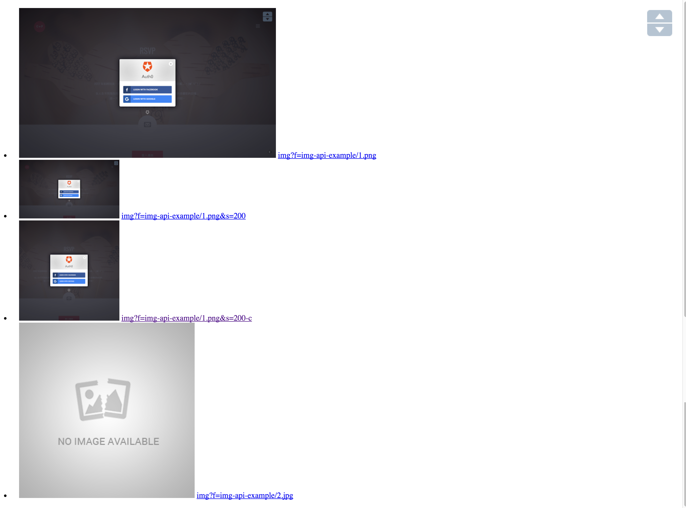

# GAE Golang: Image API example

## [Live demo](https://go-gae-image-api-example-dot-gae-lab-001.appspot.com/)

> use `"google.golang.org/appengine/image"` to serve image from GCS

- [x] [Google App Engine Go](https://cloud.google.com/appengine/docs/go/)
- [x] [image package](https://cloud.google.com/appengine/docs/go/images/reference)
- [x] [labstack/echo](https://github.com/labstack/echo)
- [x] [pongor](github.com/echo-contrib/pongor) Django-syntax like template engine

## Screenshot


## Getting Started

git clone repo

```sh
$ git clone git@github.com:cage1016/gae-go-image-example.git
```

install go package

```sh
$ go get -u github.com/echo-contrib/pongor
$ go get -u github.com/labstack/echo
$ go get -u golang.org/x/net
$ go get -u google.golang.org/appengine
```

replace project settings

_main.go_

```go
const (
	Bucket           = "<your-gae-default-bucket>"
	NotFoundImageURL = "img-api-example/img404.jpg"
)
```

_makefile_

```sh
ACCOUNT = <your-google-account>
PROJECT = <your-gcp-project>
VERSION = <your-gcp-project-version>
```

running locally

> blobstore image api does not work locally

```
// running locally
$ make run

// deploy
$ make update
```
